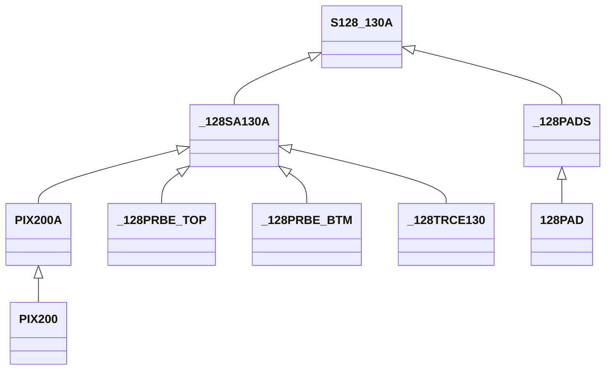

---
aliases:
tags:
---

# Hierarchy of Cells

## Architecture Cells

There are a number of pixel architectures. Each architecture has a unique cell, which are the highest-order cells in the tree, and which are used to tile the wafer geometry.

- **Chip Multiplicity** - Number of pixels per chip
	- (`$128`)-pixel chips
	- (`$32`)-pixel chips
- **Pixel Size** - Size of pixel
	- (`200`) micron
	- (`130`) micron
	- (`70`) micron
- **Chip Type**
	- (` `) Basic
	- (`A`) Absorber Included
	- (`B`) BeEST Logo Included
	- (`C`) Both Included (A+B)

Thus, the total number of possible devices is (2 \* 3 \* 4 \= 24) possibilities. Add two for the Test Chips:

- (`TC`)
- (`TC_B`) (with BeEST Logo)

which feature fourteen pixels in pairs, spanning each size and type - either with or without absorber. This is true for all but the 70-micron absorber type, which allows for quadruple redundancy on these smallest, highest-resolution - and thus potentially most important - devices. The final pair is of regular, 130-micron pixels defined without a [[DRIE back-etch]], to enable benchmarking of the devices' performance with or without a silicon substrate.

## Subsystem Cells

These subsystem cells group geometry by function on the chip. These include:

- (`PADS`) - Pads provide signal interface beyond the chips
- (`TRCE`) - Traces route signal from pixel to pads
- (`PRBE`) - Probes interface pixel to trace
	- (`PRBE_TOP`) - Nb probe to upper STJ electrode, with SiO2 patch for electrical insulation
	- (`PRBE_BTM`) - Al probe to bottom STJ electrode, with Nb plugs for quasiparticle insulation
	- (`CONN_BTM`) - Special Al probe for 32 pixel chips that connects two subarray pixels together
- (`SUB`) - Subarrays group pixels which share a common ground
	- (`SUB_TRCE`) - 128 pixel subarrays have their own internal traces and geometry

## Core Cells

These core cells group geometry into core, lowest-order, features, which include:

- (`PIX`) - Pixels, which have a size in µm, and possibly the following features:
	- (`A`) - Absorber
- (`PAD`) - Pads, which may be of a specific size in µm, or shape:
	- (`S`) - Square

# Cell Naming

Names describe the features of each cell, uniquely identifying it by hierarchy, subsystem, or core feature. These names are given precedence following:

1. Multiplicity (*e.g. `128`*)
2. Subsystem (*e.g.* `128TRCE`)
3. Core (e.g. `128PAD`)
4. Size (e.g. `128TRCE200`)
5. Feature (e.g. `PAD200S`)

To enable easy readability, names are a concatenation of numeric and alphabetic identifiers, broken up with a single `_` where sequential numeric or alphabetic identifiers are needed. Additionally, highest-order cells are identified with a `$` to help ensure only the correct cells are exposed when viewing the final overall wafer layout. This is opposed to subsystem cells, prefixed by a single `_` and core cells, which have no prefix.

## Cell List

[Cell List](Cell List.xlsx)

**Feature**

